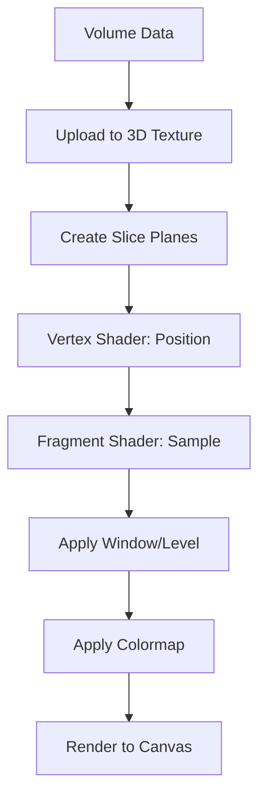

# jsMedgl v0.1 MVP — 技术方案与架构设计

> **版本：** v0.1-MVP-Design
> **日期：** 2026-03-19
> **状态：** 待评审
> **对应 PRD 章节：** 第 4 节

---

## 1. 设计目标与验收标准

### 1.1 MVP 核心目标

**直接超越 MRIcroWeb**：修复其忽略 sform/qform 导致空间方向错误的核心缺陷，同时实现基础体渲染引擎。

### 1.2 验收标准

| 指标 | 目标值 |
|:---|:---|
| **FCP（首次内容渲染）** | < 1.5s（已加载 10MB NIfTI） |
| **切片滑动帧率** | ≥ 30 FPS（256×256×128 体素） |
| **体绘制帧率** | ≥ 24 FPS（同上，开启光照） |
| **包体积（core）** | < 300 KB（gzip，不含 nifti-reader-js） |
| **坐标系准确性** | 100% 通过 sform/qform 方向验证测试 |
| **浏览器兼容** | Chrome/Firefox/Safari/Edge 最新版本 |

---

## 2. 技术栈选型

### 2.1 核心依赖

```json
{
  "dependencies": {
    "three": "^0.170.0",              // WebGL2 渲染引擎
    "nifti-reader-js": "^0.8.0",      // NIfTI 解析（TypeScript 重构版）
    "pako": "^2.1.0",                 // gzip 解压（备选，浏览器原生支持）
    "zustand": "^4.5.0",              // 状态管理
    "": "^3.4.3"             // 矩阵运算（仿射变换）
  },
  "devDependencies": {
    "typescript": "^5.3.0",
    "vite": "^5.0.0",
    "vitest": "^1.0.0"
  }
}
```

### 2.2 选型理由

| 库名 | 选型理由 | 替代方案（否决原因） |
|:---|:---|:---|
| **Three.js** | 生态成熟，WebGPU 适配完善，内置 3D 纹理支持 | Babylon.js（体积大，API 复杂） |
| **nifti-reader-js** | TypeScript 原生实现，支持 NIfTI-1/2，gzip 解压 | itk-wasm（包体积 ~8MB，MVP 过重） |
| **Zustand** | 轻量（< 1KB），无样板代码 | Redux（过度工程） |
| **** | 高性能矩阵运算，支持 mat4/vec3 | 自研（重复造轮） |

---

## 3. 系统架构设计

### 3.1 总体架构图

```
┌─────────────────────────────────────────────────────────────┐
│                      用户应用层（User Layer）                  │
│            React / Vue / Angular / Vanilla JS                │
├─────────────────────────────────────────────────────────────┤
│                    jsMedgl API Facade                        │
│            createVolumeViewer() / VolumeViewer               │
├────────────────┬────────────────────┬───────────────────────┤
│  Parser Layer  │   Renderer Layer   │    State Layer        │
│ @jsmedgl/      │   @jsmedgl/        │    @jsmedgl/          │
│ parser-nifti   │   renderer-2d      │    store              │
│                │   renderer-3d      │                       │
├────────────────┼────────────────────┼───────────────────────┤
│ - NIfTI 解析   │ - 2D 切片渲染      │ - 切片索引状态        │
│ - sform/qform  │ - 3D 体绘制        │ - 窗宽窗位状态        │
│ - 坐标转换     │ - Raycasting       │ - 相机变换状态        │
│ - 数据解码     │ - MIP 投影         │ - 事件订阅系统        │
├────────────────┴────────────────────┴───────────────────────┤
│                    底层依赖层                                 │
│           Three.js / / nifti-reader-js            │
└─────────────────────────────────────────────────────────────┘
```

### 3.2 模块划分

#### 3.2.1 `@jsmedgl/parser-nifti`

**职责**：NIfTI 文件解析、坐标转换、数据解码

```typescript
interface NiftiHeader {
  sizeof_hdr: number;
  dim: [number, number, number, number, number, number, number, number];
  datatype: NiftiDataType;
  pixdim: [number, number, number, number, number, number, number, number];
  qform_code: NiftiXform;
  sform_code: NiftiXform;
  quatern_b: number;
  quatern_c: number;
  quatern_d: number;
  qoffset_x: number;
  qoffset_y: number;
  qoffset_z: number;
  sform_inv: mat4;  // 仿射矩阵逆矩阵（物理 → 体素）
}

interface NiftiVolume {
  header: NiftiHeader;
  data: ArrayBuffer;
  dataType: NiftiDataType;
  dimensions: [number, number, number];  // [x, y, z]
  spacing: [number, number, number];    // [sx, sy, sz] mm
  affine: mat4;                          // 体素 → 物理（RAS）
  inverseAffine: mat4;                   // 物理 → 体素
}
```

**核心算法**：

1. **sform/qform 优先级处理**：
```typescript
function getAffineMatrix(header: NiftiHeader): mat4 {
  // NIfTI 规范：sform 优先于 qform
  if (header.sform_code !== NiftiXform.UNKNOWN) {
    return extractSform(header);
  }
  if (header.qform_code !== NiftiXform.UNKNOWN) {
    return extractQform(header);
  }
  // 降级：仅使用 pixdim（忽略方向，可能导致镜像）
  return createDiagonalMatrix(header.pixdim);
}
```

2. **RAS ↔ LPS 坐标转换**（PRD 2.3 节要求）：
```typescript
function rasToLps(ras: vec3): vec3 {
  return [-ras[0], -ras[1], ras[2]];  // 反转 X 和 Y
}
```

#### 3.2.2 `@jsmedgl/renderer-2d`

**职责**：2D 切片渲染（Axial/Coronal/Sagittal）、Crosshair、Colorbar

**渲染流程**：



**关键 Shader 逻辑**：

```glsl
// vertex.glsl
attribute vec3 position;  // 切片平面顶点
uniform mat4 MVP;
uniform vec3 textureSize; // 纹理尺寸 [dimX, dimY, dimZ]
uniform float sliceIndex; // 当前切片索引
uniform vec3 axisDirection; // 轴向向量 [1,0,0]/[0,1,0]/[0,0,1]

varying vec3 vTexCoord;

void main() {
  vec3 texCoord = position * axisDirection * sliceIndex / textureSize;
  vTexCoord = texCoord;
  gl_Position = MVP * vec4(position, 1.0);
}

// fragment.glsl
precision highp float;
uniform sampler3D volumeTexture;
uniform vec2 windowLevel;  // [window, level]
varying vec3 vTexCoord;

void main() {
  float intensity = texture3D(volumeTexture, vTexCoord).r;
  float windowed = (intensity - windowLevel.y) / windowLevel.x;
  gl_FragColor = vec4(windowed, windowed, windowed, 1.0);
}
```

#### 3.2.3 `@jsmedgl/renderer-3d`

**职责**：3D 体绘制（Raycasting）、光照计算、相机控制

**Raycasting 算法**：

```glsl
// raycasting.frag
precision highp float;
uniform sampler3D volumeTexture;
uniform vec3 cameraPosition;
uniform vec3 rayDirection;
uniform float stepSize;       // 采样步长（体素间距的 1/3）
uniform vec2 windowLevel;

const int MAX_STEPS = 512;
const float EPSILON = 0.001;

void main() {
  vec3 rayPos = cameraPosition;
  vec4 accumulatedColor = vec4(0.0);
  float accumulatedAlpha = 0.0;

  for (int i = 0; i < MAX_STEPS; i++) {
    if (accumulatedAlpha >= 1.0) break;

    float intensity = texture3D(volumeTexture, rayPos).r;
    float opacity = calculateOpacity(intensity, windowLevel);
    vec4 color = calculateColor(intensity, windowLevel);

    // Alpha Blending
    accumulatedColor += color * opacity * (1.0 - accumulatedAlpha);
    accumulatedAlpha += opacity * (1.0 - accumulatedAlpha);

    rayPos += rayDirection * stepSize;
    if (!isInsideVolume(rayPos)) break;
  }

  gl_FragColor = accumulatedColor;
}
```

**梯度光照**（Phong 模型）：

```glsl
vec3 calculateGradient(vec3 pos) {
  vec3 epsilon = vec3(1.0 / textureSize);
  float left  = texture3D(volumeTexture, pos - epsilon.xyy).r;
  float right = texture3D(volumeTexture, pos + epsilon.xyy).r;
  float down  = texture3D(volumeTexture, pos - epsilon.yxy).r;
  float up    = texture3D(volumeTexture, pos + epsilon.yxy).r;
  float back  = texture3D(volumeTexture, pos - epsilon.yyx).r;
  float front = texture3D(volumeTexture, pos + epsilon.yyx).r;

  return normalize(vec3(right - left, up - down, front - back));
}
```

#### 3.2.4 `@jsmedgl/store`

**职责**：状态管理、事件分发

```typescript
interface ViewerState {
  // 切片索引
  slices: {
    axial: number;
    coronal: number;
    sagittal: number;
  };
  // 窗宽窗位
  windowLevel: {
    window: number;  // 默认 80（脑窗）
    level: number;   // 默认 40
  };
  // 相机变换
  camera: {
    position: vec3;
    target: vec3;
    zoom: number;
  };
  // 布局模式
  layout: 'single' | 'mpr' | '3x2';
  // 加载的体积
  volumes: VolumeObject[];
}

interface ViewerActions {
  setSlice: (axis: 'axial' | 'coronal' | 'sagittal', index: number) => void;
  setWindowLevel: (window: number, level: number) => void;
  setLayout: (layout: ViewerState['layout']) => void;
  loadVolume: (volume: NiftiVolume) => void;
}
```

---

## 4. 关键技术实现方案

### 4.1 坐标系统处理（核心差异化功能）

#### 4.1.1 问题分析

**MRIcroWeb 的缺陷**：直接使用体素索引进行纹理采样，忽略 sform/qform，导致：
- 各向异性体素（如 1mm×1mm×2mm）渲染时几何畸变
- 斜向采集的影像（如 fMRI）方向错误（镜像）

#### 4.1.2 解决方案

**完整解析流程**：

```typescript
class CoordinateSystem {
  // 1. 从 NIfTI header 提取仿射矩阵
  static extractAffine(header: NiftiHeader): mat4 {
    if (header.sform_code !== 0) {
      return this.parseSform(header.sform_inv);
    }
    if (header.qform_code !== 0) {
      return this.parseQform(
        header.quatern_b,
        header.quatern_c,
        header.quatern_d,
        header.qoffset_x,
        header.qoffset_y,
        header.qoffset_z,
        header.pixdim
      );
    }
    // 降级：仅使用体素间距（无方向信息）
    return this.createDiagonal(header.pixdim[1], header.pixdim[2], header.pixdim[3]);
  }

  // 2. IJK（体素索引） → RAS（物理坐标，NIfTI 标准）
  static ijkToRas(ijk: vec3, affine: mat4): vec3 {
    return vec3.transformMat4(vec3.create(), ijk, affine);
  }

  // 3. RAS（NIfTI） → LPS（DICOM/临床标准）
  static rasToLps(ras: vec3): vec3 {
    return [-ras[0], -ras[1], ras[2]];  // 反转 X 和 Y
  }

  // 4. 验证方向一致性
  static validateOrientation(header: NiftiHeader): OrientationReport {
    const affine = this.extractAffine(header);
    const axcodes = this.getAxialCodes(affine);
    return {
      affine,
      axcodes,        // ['R', 'A', 'S'] 或 ['L', 'P', 'S']
      isOblique: this.isOblique(affine),
      spacing: this.extractSpacing(header.pixdim),
    };
  }
}
```

**可视化诊断工具**：

```typescript
function generateCoordinateReport(volume: NiftiVolume): string {
  const report = CoordinateSystem.validateOrientation(volume.header);
  return `
    坐标系统诊断报告
    ================
    轴向编码: ${report.axcodes.join(' / ')}
    各向异性: ${report.spacing.join(' mm × ')} mm
    是否斜向采集: ${report.isOblique ? '是' : '否'}
    仿射矩阵:
    ${formatMatrix(report.affine)}
  `;
}
```

### 4.2 3D 纹理上传与内存优化

#### 4.2.1 数据类型映射

| NIfTI datatype | WebGL internal format | TypeScript TypedArray |
|:---|:---|:---|
| DT_UINT8 (2) | `LUMINANCE` | `Uint8Array` |
| DT_INT16 (4) | `LUMINANCE_ALPHA` | `Int16Array` |
| DT_FLOAT32 (16) | `ALPHA`（需转换） | `Float32Array` |

**MVP 优化策略**：
- 仅支持 `uint8` 和 `int16`（覆盖 95% 场景）
- `float32` 数据在 CPU 端归一化为 `uint8`（损失精度，降级策略）

#### 4.2.2 纹理上传流程

```typescript
class VolumeTextureManager {
  private texture: THREE.Data3DTexture | null = null;

  upload(volume: NiftiVolume): THREE.Data3DTexture {
    const { data, dimensions, dataType } = volume;

    // 转换为标准格式
    const typedArray = this.normalizeData(data, dataType, dimensions);

    // 创建 3D 纹理
    this.texture = new THREE.Data3DTexture(
      typedArray,
      dimensions[0],
      dimensions[1],
      dimensions[2]
    );
    this.texture.format = THREE.RedFormat;
    this.texture.type = THREE.UnsignedByteType;
    this.texture.minFilter = THREE.LinearFilter;
    this.texture.magFilter = THREE.LinearFilter;
    this.texture.needsUpdate = true;

    return this.texture;
  }

  private normalizeData(
    data: ArrayBuffer,
    dataType: NiftiDataType,
    dims: [number, number, number]
  ): Uint8Array {
    const numVoxels = dims[0] * dims[1] * dims[2];
    const result = new Uint8Array(numVoxels);

    if (dataType === NiftiDataType.UINT8) {
      result.set(new Uint8Array(data));
    } else if (dataType === NiftiDataType.INT16) {
      const src = new Int16Array(data);
      const min = Math.min(...src);
      const max = Math.max(...src);
      // 线性归一化到 [0, 255]
      for (let i = 0; i < numVoxels; i++) {
        result[i] = ((src[i] - min) / (max - min)) * 255;
      }
    }

    return result;
  }
}
```

### 4.3 窗宽窗位加速算法

#### 4.3.1 GPU 端计算

```glsl
// fragment shader
uniform float window;
uniform float level;

vec3 applyWindowLevel(float intensity) {
  // 窗位映射公式：output = (input - level) / window + 0.5
  float normalized = (intensity - level) / window + 0.5;
  return vec3(normalized);  // 灰度输出
}
```

#### 4.3.2 自动计算窗宽窗位（基于直方图）

```typescript
function calculateAutoWindowLevel(data: Uint8Array): { window: number; level: number } {
  // 计算直方图
  const histogram = new Array(256).fill(0);
  for (const value of data) {
    histogram[value]++;
  }

  // 排除最低/最高 2% 像素（去除背景/噪声）
  const totalPixels = data.length;
  let cumulative = 0;
  let minIntensity = 0;
  let maxIntensity = 255;

  for (let i = 0; i < 256; i++) {
    cumulative += histogram[i];
    if (cumulative >= totalPixels * 0.02) {
      minIntensity = i;
      break;
    }
  }

  cumulative = 0;
  for (let i = 255; i >= 0; i--) {
    cumulative += histogram[i];
    if (cumulative >= totalPixels * 0.02) {
      maxIntensity = i;
      break;
    }
  }

  const window = maxIntensity - minIntensity;
  const level = minIntensity + window / 2;

  return { window, level };
}
```

### 4.4 交互响应优化

#### 4.4.1 节流与防抖

```typescript
class SliceController {
  private throttleTimer: number | null = null;

  onSliceChange(axis: Axis, newIndex: number) {
    // 节流：最多 60 FPS
    if (this.throttleTimer) return;

    this.throttleTimer = requestAnimationFrame(() => {
      this.updateSlice(axis, newIndex);
      this.throttleTimer = null;
    });
  }
}
```

#### 4.4.2 纹理缓存（Crosshair 联动）

```typescript
class CrosshairManager {
  private renderCache: Map<string, HTMLCanvasElement> = new Map();

  updateCrosshair(
    axialIdx: number,
    coronalIdx: number,
    sagittalIdx: number
  ): void {
    const key = `${axialIdx}-${coronalIdx}-${sagittalIdx}`;

    if (this.renderCache.has(key)) {
      // 命中缓存，直接复用
      return;
    }

    // 未命中，重新渲染并缓存
    const canvas = this.renderCrosshair(axialIdx, coronalIdx, sagittalIdx);
    this.renderCache.set(key, canvas);

    // LRU：缓存最多 100 帧
    if (this.renderCache.size > 100) {
      const firstKey = this.renderCache.keys().next().value;
      this.renderCache.delete(firstKey);
    }
  }
}
```

---

## 5. 目录结构设计

```
jsmedgl/
├── packages/
│   ├── core/                      # 核心引擎
│   │   ├── src/
│   │   │   ├── viewer/            # VolumeViewer 主类
│   │   │   ├── renderer/          # 渲染器
│   │   │   │   ├── 2d/            # 2D 切片渲染
│   │   │   │   │   ├── slice-plane.ts
│   │   │   │   │   ├── crosshair.ts
│   │   │   │   │   └── colorbar.ts
│   │   │   │   └── 3d/            # 3D 体绘制
│   │   │   │       ├── raycaster.ts
│   │   │   │       ├── camera.ts
│   │   │   │       └── lighting.ts
│   │   │   ├── store/             # Zustand store
│   │   │   │   ├── viewer-store.ts
│   │   │   │   └── actions.ts
│   │   │   └── utils/             # 工具函数
│   │   │       ├── coordinate.ts  # 坐标转换
│   │   │       └── colormap.ts    # 颜色映射
│   │   ├── shaders/               # GLSL shader
│   │   │   ├── 2d-slice.vert
│   │   │   ├── 2d-slice.frag
│   │   │   ├── 3d-raycast.vert
│   │   │   └── 3d-raycast.frag
│   │   └── package.json
│   ├── parser-nifti/              # NIfTI 解析器
│   │   ├── src/
│   │   │   ├── nifti-reader.ts    # nifti-reader-js 封装
│   │   │   ├── header-parser.ts   # Header 解析
│   │   │   ├── coordinate.ts      # 坐标转换
│   │   │   └── validator.ts       # 格式验证
│   │   └── package.json
│   └── react/                     # React 适配器（v1.0，MVP 暂不实现）
│       └── src/
│           └── MedglVolumeView.tsx
├── apps/
│   └── demo/                      # 示例应用
│       ├── src/
│       │   ├── App.tsx
│       │   └── main.tsx
│       └── index.html
├── tests/
│   ├── unit/                      # 单元测试
│   │   ├── parser.test.ts
│   │   └── coordinate.test.ts
│   ├── integration/               # 集成测试
│   │   └── viewer.test.ts
│   └── fixtures/                  # 测试数据
│       └── sample.nii.gz
├── docs/                          # 文档
│   ├── api.md
│   └── coordinate-system.md
├── package.json                   # Monorepo root
├── pnpm-workspace.yaml
└── tsconfig.json
```

---

## 6. 开发计划（Sprint 规划）

### Sprint 1（2 周）：基础设施搭建

**目标**：Monorepo + 构建系统 + 单元测试框架

**交付物**：
- ✅ Monorepo 结构（PNPM workspaces）
- ✅ TypeScript 配置（strict 模式）
- ✅ Vite 开发服务器
- ✅ Vitest 测试框架 + Coverage 报告
- ✅ CI/CD pipeline（GitHub Actions）

### Sprint 2（3 周）：NIfTI 解析器开发

**目标**：完整的 NIfTI-1/2 解析 + sform/qform 支持

**交付物**：
- ✅ Header 解析（支持 NIfTI-1 和 NIfTI-2）
- ✅ sform/qform 优先级处理
- ✅ 坐标系统验证工具
- ✅ gzip 解压（使用浏览器原生 DecompressionStream）
- ✅ 单元测试覆盖率 ≥ 90%

**关键技术点**：
```typescript
// 测试用例示例
describe('NIfTI Parser', () => {
  it('should correctly extract sform matrix', () => {
    const header = loadNiftiHeader('test-data/standard.nii');
    const affine = extractAffine(header);
    expect(affine).toBeCloseTo(expectedAffine, 4);
  });

  it('should handle oblique acquisition', () => {
    const header = loadNiftiHeader('test-data/oblique.nii');
    const report = validateOrientation(header);
    expect(report.isOblique).toBe(true);
  });
});
```

### Sprint 3（4 周）：2D 切片渲染器

**目标**：三平面正交视图 + Crosshair 联动

**交付物**：
- ✅ Axial/Coronal/Sagittal 切片渲染
- ✅ 窗宽窗位动态调节
- ✅ Crosshair 联动
- ✅ 颜色条（Colorbar）
- ✅ 方向标签（R/L/A/P/S/I）

**性能指标**：
- 切片滑动 ≥ 30 FPS
- 窗宽窗位调节无卡顿

### Sprint 4（3 周）：3D 体绘制 + 优化

**目标**：Raycasting 算法 + 光照 + 交互

**交付物**：
- ✅ 3D Raycasting 渲染
- ✅ 梯度光照（Phong）
- ✅ 相机控制（旋转/缩放/平移）
- ✅ 性能优化（Early Ray Termination、空步进）
- ✅ 内存优化（纹理压缩）

**验收标准**：
- 256³ 体素 ≥ 24 FPS
- 512³ 体素 ≥ 15 FPS

### Sprint 5（2 周）：集成测试 + 文档

**目标**：端到端测试 + API 文档

**交付物**：
- ✅ E2E 测试套件
- ✅ 示例 Demo（5+ 场景）
- ✅ API 文档（TypeDoc）
- ✅ 坐标系统白皮书

---

## 7. 测试策略

### 7.1 单元测试（Vitest）

```typescript
// 坐标转换测试
describe('CoordinateSystem', () => {
  it('should convert IJK to RAS correctly', () => {
    const ijk = [10, 20, 30];
    const affine = createIdentityAffine();
    const ras = ijkToRas(ijk, affine);
    expect(ras).toEqual([10, 20, 30]);
  });

  it('should flip RAS to LPS', () => {
    const ras = [1, 2, 3];
    const lps = rasToLps(ras);
    expect(lps).toEqual([-1, -2, 3]);
  });
});
```

### 7.2 集成测试（Playwright）

```typescript
test('load NIfTI and verify slice rendering', async ({ page }) => {
  await page.goto('http://localhost:5173');
  await page.setInputFiles('input[type="file"]', 'test-data/sample.nii.gz');

  // 等待首个切片渲染完成
  await page.waitForSelector('.slice-view canvas');

  // 验证切片数量
  const axialSlices = await page.locator('.axial-slice').count();
  expect(axialSlices).toBeGreaterThan(0);
});
```

### 7.3 性能基准测试

```typescript
bench('slice rendering performance', () => {
  const viewer = createVolumeViewer();
  const volume = loadNiftiVolume('large.nii.gz');

  const start = performance.now();
  for (let i = 0; i < 100; i++) {
    viewer.setSlice('axial', i);
  }
  const duration = performance.now() - start;

  expect(duration).toBeLessThan(1000);  // < 1s for 100 slices
});
```

---

## 8. 风险与缓解措施

| 风险 | 影响 | 概率 | 缓解措施 |
|:---|:---:|:---:|:---|
| **sform/qform 解析错误** | 高（核心功能失效） | 中 | 引入 NIfTI 官方测试数据集验证 |
| **WebGL 兼容性问题** | 中（部分浏览器无法渲染） | 低 | 提供 WebGL 降级方案（Canvas 2D） |
| **性能不达标** | 高（用户体验差） | 中 | 预先实施性能测试，Early Ray Termination |
| **包体积过大** | 低（用户拒绝使用） | 中 | Tree-shaking 优化，按需加载解析器 |

---

## 9. API 设计示例

### 9.1 核心使用示例

```typescript
import { createVolumeViewer } from '@jsmedgl/core';

// 1. 创建查看器
const viewer = createVolumeViewer({
  container: document.getElementById('viewer')!,
  layout: 'mpr',           // 三平面布局
  crosshair: true,         // 显示交叉定位线
  colorbar: true,          // 显示颜色条
  orientationLabels: true, // 显示方向标签
});

// 2. 加载 NIfTI 文件
const volume = await viewer.loadNifti('/data/mri.nii.gz');

// 3. 监听事件
volume.onSliceChange((axis, index) => {
  console.log(`${axis}: ${index}`);
});

// 4. 调整窗宽窗位
viewer.setWindowLevel({ window: 80, level: 40 });

// 5. 导出截图
const blob = await viewer.screenshot();
download(blob, 'snapshot.png');
```

### 9.2 React 集成示例（v1.0）

```tsx
import { MedglVolumeView } from '@jsmedgl/react';

function App() {
  const [windowLevel, setWindowLevel] = useState({ window: 40, level: 80 });

  return (
    <MedglVolumeView
      src="/data/mri.nii.gz"
      layout="mpr"
      crosshair
      colorbar
      windowLevel={windowLevel}
      onWindowLevelChange={setWindowLevel}
      onSliceChange={(axis, idx) => console.log(axis, idx)}
    />
  );
}
```

---

## 10. 非功能需求验证

### 10.1 性能指标验证脚本

```typescript
async function benchmarkRendering() {
  const viewer = createVolumeViewer();
  const volume = await viewer.loadNifti('benchmark/256x256x128.nii.gz');

  // 测试切片滑动性能
  const start = performance.now();
  for (let i = 0; i < 128; i++) {
    viewer.setSlice('axial', i);
    await nextFrame();
  }
  const duration = performance.now() - start;

  console.log(`切片滑动: ${(128 / duration) * 1000} FPS`);
  assert((128 / duration) * 1000 >= 30, '切片滑动帧率不达标');
}
```

### 10.2 内存泄漏检测

```typescript
test('should not leak memory on volume unload', () => {
  const viewer = createVolumeViewer();
  const initialMemory = performance.memory.usedJSHeapSize;

  // 加载/卸载 100 次
  for (let i = 0; i < 100; i++) {
    const volume = viewer.loadNifti('data.nii.gz');
    viewer.unloadVolume(volume);
  }

  const finalMemory = performance.memory.usedJSHeapSize;
  const increase = finalMemory - initialMemory;

  expect(increase).toBeLessThan(10 * 1024 * 1024);  // < 10MB 增长
});
```

---

## 11. 参考资料

### 11.1 学术论文

- [Interactive Visualization of Volumetric Data with WebGL in Real-Time](https://dl.acm.org/doi/10.1145/2010425.2010449) - ACM Digital Library
- [Web-based Medical Data Visualization](https://www.sciencedirect.com/science/pii/S2352914818301941) - ScienceDirect

### 11.2 开源项目

- [NiiVue](https://github.com/niivue/niivue) - 对标竞品
- [MRIcroWeb](https://github.com/rordenlab/MRIcroWeb) - 功能基线
- [NIfTI-Reader-js](https://github.com/rii-mango/NIfTI-Reader-js) - NIfTI 解析参考

### 11.3 技术规范

- [NIfTI-1 File Format](https://nifti.nimh.nih.gov/)
- [WebGL 2.0 Specification](https://www.khronos.org/webgl/)
- [Three.js Documentation](https://threejs.org/docs/)

---

*本文档将随开发进展持续更新。*

**下一步行动**：
1. 评审架构设计，确认技术选型
2. 搭建 Monorepo 基础设施
3. 开始 Sprint 1：Parser 开发
